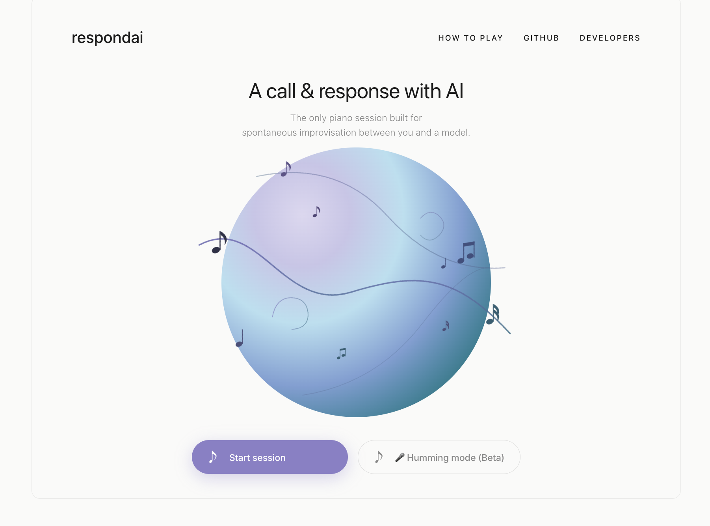
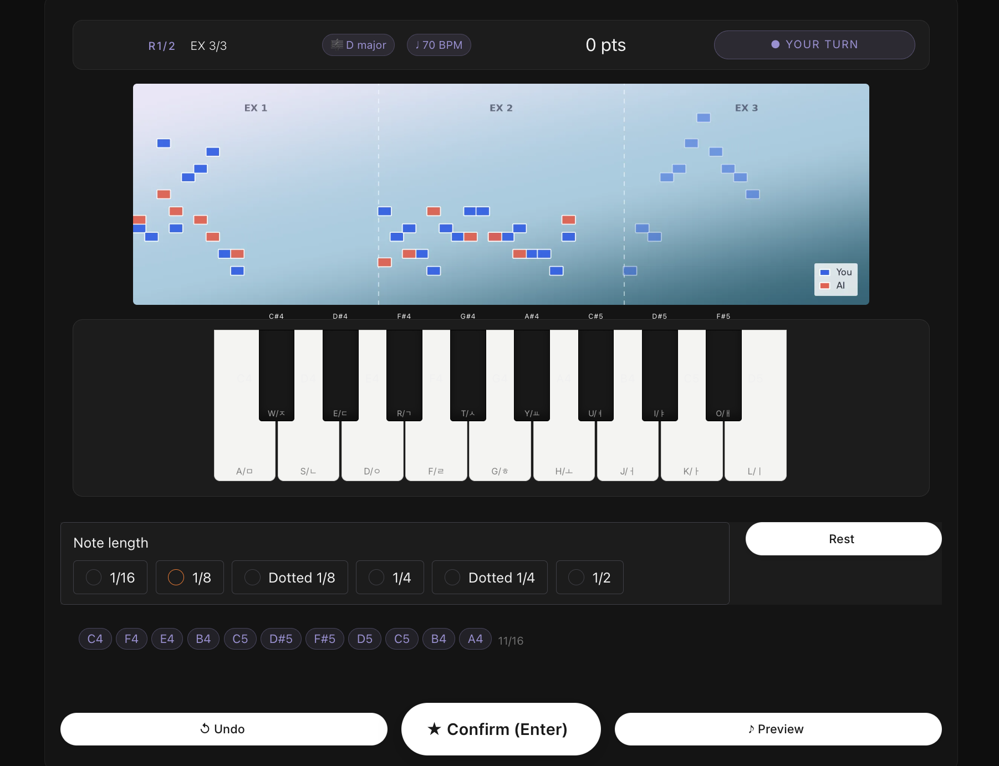
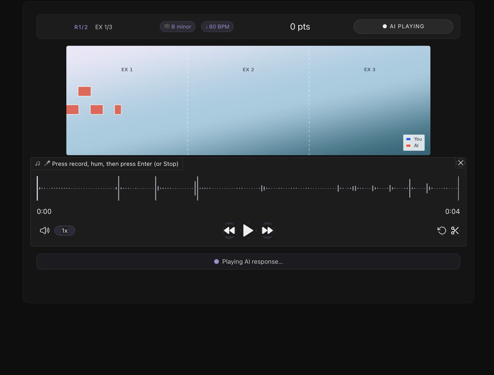
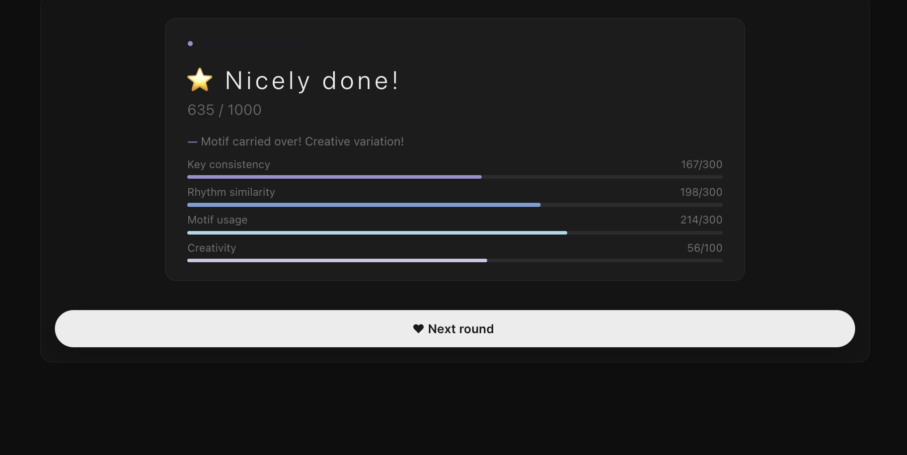
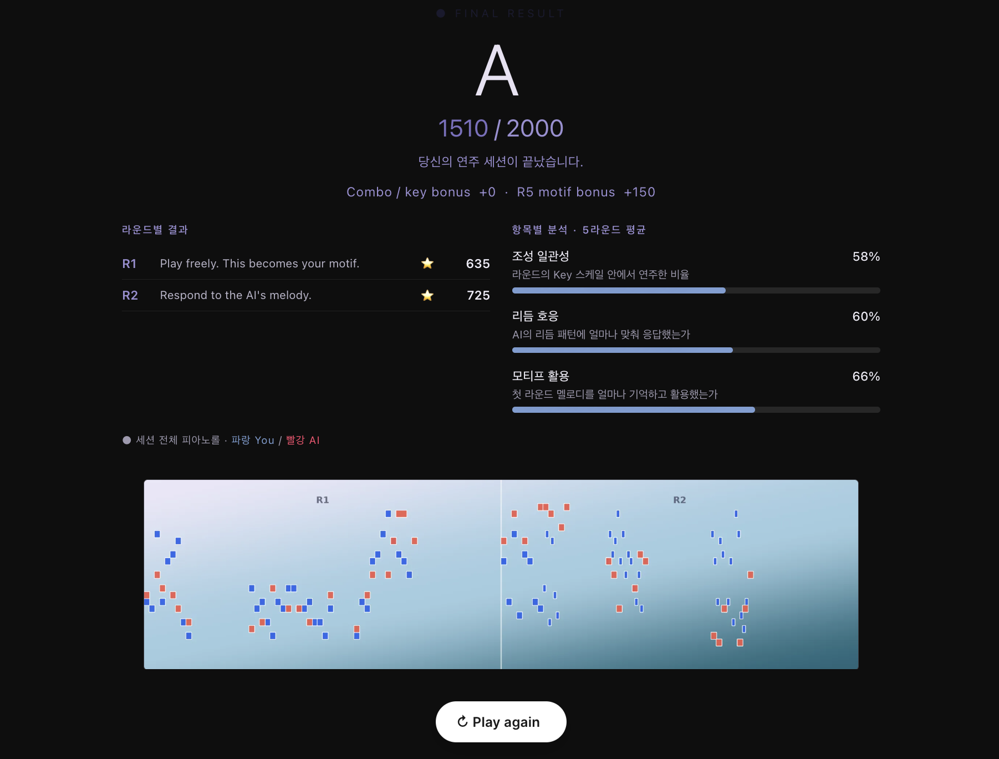

# RespondAI 🎹

> A call & response with AI — 재즈 즉흥연주의 AI 대화 게임

[](https://huggingface.co/spaces/uuyeong/respondai)

---

## 데모

**▶ [지금 플레이하기](https://huggingface.co/spaces/uuyeong/respondai)**



---

## 게임 소개

재즈에서 두 연주자가 멜로디를 주고받는 **Call & Response**에서 아이디어를 얻었습니다.
유저가 멜로디를 연주하면, AI가 그에 응답하는 방식으로 즉흥 연주 세션이 진행됩니다.

### 게임 흐름

- **2라운드** 구성, 매 라운드마다 Key와 BPM이 랜덤 지정
- 라운드 안에서 유저와 AI가 **3번씩** 멜로디를 주고받음
- **Round 1** — 자유롭게 연주 (모티프 저장)
- **Round 2** — AI 멜로디에 호응

### 입력 방식

| 모드 | 상태 |
|------|------|
| 피아노 모드 | ✅ 완성 |
| 허밍 모드 | 🔬 베타 (환경에 따라 음정 인식 불안정) |

---

## 화면 구성

### 피아노 모드 — 게임 진행



피아노 건반으로 음표를 입력하고 Confirm으로 제출하면 AI가 응답합니다.
상단 피아노롤에서 유저(파랑)와 AI(빨강)의 멜로디를 실시간으로 확인할 수 있습니다.

### 허밍 모드



마이크로 허밍하면 PESTO 모델이 음정을 인식해 Note로 변환합니다.

### 라운드 결과



3교환의 항목별 평균으로 채점됩니다.

| 항목 | 만점 | 기준 |
|------|------|------|
| Key consistency | 300 | 조성 안 음표 비율 |
| Rhythm similarity | 300 | AI 프레이즈와 리듬 상관관계 |
| Motif usage | 300 | R1 모티프 n-gram 겹침 |
| Creativity | 100 | 복사도 아니고 무관도 아닌 중간 |

### 최종 결과



2라운드 합산 최대 2000점, S·A·B·C 등급과 항목별 분석, 전체 피아노롤 제공.

---

## AI 생성 원리

```
유저 음표
  → REMI 토큰화 (POS + PITCH + DUR, 16분음표 단위)
  → Decoder-only Transformer (~19M params, Lakh MIDI 학습)
     온도 0.82 / 0.95 / 1.08 / 1.18 → 4개 후보 동시 생성
  → 음악적 Reranker → 최적 1개 선택
  → Fast Synth (~10ms) + 재즈 반주 (Bass × Comp 랜덤 조합)
  → WAV 출력
```

**데이터셋**: [Lakh MIDI Dataset](https://colinraffel.com/projects/lmd/) — 약 17만 개 MIDI 파일
**모델**: [uuyeong/respondai-model](https://huggingface.co/uuyeong/respondai-model)

---

## 팀

| 역할 | 이름 | 담당 |
|------|------|------|
| 모델 & 분석 | 박시현 | Transformer 학습, 토크나이저, 채점 로직 |
| 프론트 & UX | 강유영 | Gradio 앱, 피아노 입력, 라운드 흐름, 결과 화면 |
